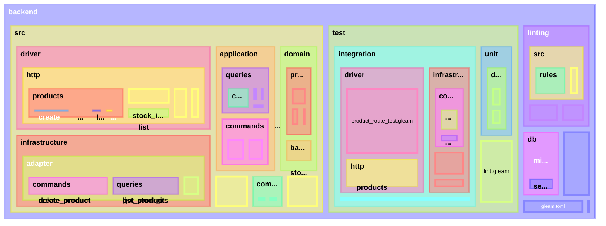
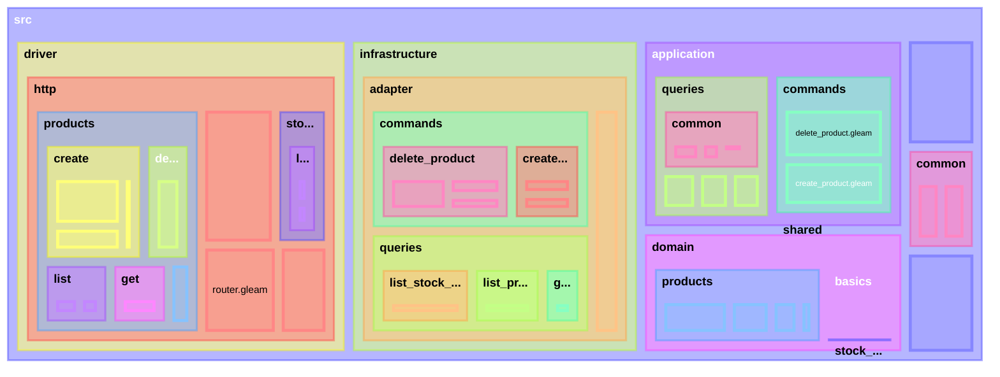
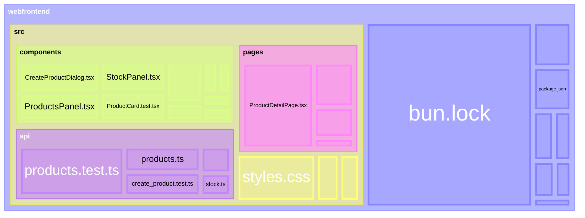
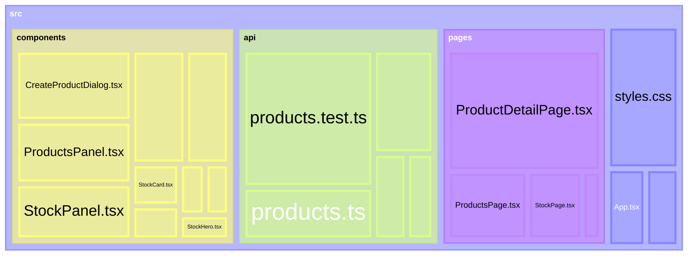

# Overview

```mermaid
---
config:
  treemap:
    showValues: false
---
treemap-beta
"full-house"
  ".devcontainer"
    "devcontainer-lock.json": 24
    "devcontainer.json": 41
    "post_create.sh": 18
  ".vscode"
    "settings.json": 24
    "tasks.json": 65
  "backend"
    "db"
      "migrations"
        "0001_create_products.sql": 9
        "0002_create_stock_items.sql": 12
        "0003_enforce_non_empty_product_name.sql": 20
        "0004_add_parent_id_index.sql": 5
      "seeds"
        "dev"
          "dev_seed.sql": 28
    "linting"
      "src"
        "rules"
          "depends_only_on.gleam": 110
        "source_map.gleam": 39
      "gleam.toml": 30
      "manifest.toml": 24
    "src"
      "application"
        "commands"
          "create_product.gleam": 63
          "delete_product.gleam": 71
        "queries"
          "common"
            "page_limit.gleam": 31
            "page_offset.gleam": 22
            "paging.gleam": 10
            "product_query_model.gleam": 13
            "stock_item_query_model.gleam": 9
          "get_product.gleam": 18
          "list_products.gleam": 16
          "list_stock_items.gleam": 16
        "shared"
          "infrastructure_error.gleam": 3
      "common"
        "product_id.gleam": 20
        "uuid.gleam": 20
      "domain"
        "basics"
          "conditional.gleam": 17
          "non_empty_set.gleam": 28
        "products"
          "deletable_product_id.gleam": 34
          "existing_product_id.gleam": 23
          "product.gleam": 12
          "product_name.gleam": 56
        "stock_items"
          "stock_item.gleam": 7
      "driver"
        "http"
          "products"
            "create"
              "handler.gleam": 43
              "request_mapper.gleam": 81
              "response_mapper.gleam": 22
            "delete"
              "handler.gleam": 68
            "get"
              "handler.gleam": 44
            "list"
              "handler.gleam": 29
              "response_mapper.gleam": 22
            "product_json.gleam": 17
          "stock_items"
            "list"
              "handler.gleam": 29
              "response_mapper.gleam": 34
          "handler_helpers.gleam": 39
          "pagination_request_mapper.gleam": 86
          "router.gleam": 58
      "infrastructure"
        "adapter"
          "commands"
            "create_product"
              "create_adapter.gleam": 42
              "product_existence_adapter.gleam": 42
            "delete_product"
              "delete_adapter.gleam": 35
              "deletion_properties_adapter.gleam": 82
              "load_product_adapter.gleam": 39
          "queries"
            "get_product"
              "get_product_adapter.gleam": 40
            "list_products"
              "list_products_adapter.gleam": 69
            "list_stock_items"
              "list_stock_items_adapter.gleam": 92
          "decoder.gleam": 57
      "composition.gleam": 42
      "full_house.gleam": 40
    "test"
      "integration"
        "driver"
          "http"
            "products"
              "delete_test.gleam": 132
            "testsetup.gleam": 30
          "product_route_test.gleam": 340
        "infrastructure"
          "commands"
            "create_product"
              "create_adapter_test.gleam": 49
            "delete_product"
              "delete_adapter_test.gleam": 45
              "deletion_properties_adapter_test.gleam": 41
              "load_product_adapter_test.gleam": 23
          "stock_repository_test.gleam": 67
          "testdatabase.gleam": 32
        "create.gleam": 45
      "unit"
        "domain"
          "product_name_property_test.gleam": 62
          "product_name_test.gleam": 54
      "full_house_test.gleam": 5
      "lint.gleam": 82
    ".editorconfig": 3
    "gleam.toml": 30
    "manifest.toml": 56
  "docs"
    "dev"
      "overview.md": 2
  "scripts"
    "build_treemaps.sh": 22
    "setup_dev_db.py": 146
    "treemap.py": 81
  "webfrontend"
    "src"
      "api"
        "create_product.test.ts": 101
        "products.test.ts": 294
        "products.ts": 112
        "stock.test.ts": 46
        "stock.ts": 38
      "components"
        "CreateProductDialog.tsx": 133
        "ProductCard.test.tsx": 99
        "ProductCard.tsx": 80
        "ProductsHero.test.tsx": 21
        "ProductsHero.tsx": 20
        "ProductsPanel.tsx": 118
        "StockCard.test.tsx": 26
        "StockCard.tsx": 33
        "StockHero.tsx": 20
        "StockPanel.tsx": 105
      "pages"
        "ProductDetailPage.tsx": 308
        "ProductsPage.tsx": 91
        "StockPage.tsx": 62
        "paginated_query_helpers.ts": 21
      "App.tsx": 39
      "index.tsx": 34
      "styles.css": 133
    "biome.json": 31
    "bun.lock": 904
    "eslint.config.ts": 51
    "index.html": 18
    "package.json": 49
    "tsconfig.json": 23
    "vite.config.ts": 25
    "vitest.config.ts": 11
  ".editorconfig": 5
  "AGENTS.md": 24
  "LICENSE": 21
  "README.md": 29
  "lefthook.yml": 26
  "output.txt": 79
```
## Backend

```mermaid
---
config:
  treemap:
    showValues: false
---
treemap-beta
"backend"
  "db"
    "migrations"
      "0001_create_products.sql": 9
      "0002_create_stock_items.sql": 12
      "0003_enforce_non_empty_product_name.sql": 20
      "0004_add_parent_id_index.sql": 5
    "seeds"
      "dev"
        "dev_seed.sql": 28
  "linting"
    "src"
      "rules"
        "depends_only_on.gleam": 110
      "source_map.gleam": 39
    "gleam.toml": 30
    "manifest.toml": 24
  "src"
    "application"
      "commands"
        "create_product.gleam": 63
        "delete_product.gleam": 71
      "queries"
        "common"
          "page_limit.gleam": 31
          "page_offset.gleam": 22
          "paging.gleam": 10
          "product_query_model.gleam": 13
          "stock_item_query_model.gleam": 9
        "get_product.gleam": 18
        "list_products.gleam": 16
        "list_stock_items.gleam": 16
      "shared"
        "infrastructure_error.gleam": 3
    "common"
      "product_id.gleam": 20
      "uuid.gleam": 20
    "domain"
      "basics"
        "conditional.gleam": 17
        "non_empty_set.gleam": 28
      "products"
        "deletable_product_id.gleam": 34
        "existing_product_id.gleam": 23
        "product.gleam": 12
        "product_name.gleam": 56
      "stock_items"
        "stock_item.gleam": 7
    "driver"
      "http"
        "products"
          "create"
            "handler.gleam": 43
            "request_mapper.gleam": 81
            "response_mapper.gleam": 22
          "delete"
            "handler.gleam": 68
          "get"
            "handler.gleam": 44
          "list"
            "handler.gleam": 29
            "response_mapper.gleam": 22
          "product_json.gleam": 17
        "stock_items"
          "list"
            "handler.gleam": 29
            "response_mapper.gleam": 34
        "handler_helpers.gleam": 39
        "pagination_request_mapper.gleam": 86
        "router.gleam": 58
    "infrastructure"
      "adapter"
        "commands"
          "create_product"
            "create_adapter.gleam": 42
            "product_existence_adapter.gleam": 42
          "delete_product"
            "delete_adapter.gleam": 35
            "deletion_properties_adapter.gleam": 82
            "load_product_adapter.gleam": 39
        "queries"
          "get_product"
            "get_product_adapter.gleam": 40
          "list_products"
            "list_products_adapter.gleam": 69
          "list_stock_items"
            "list_stock_items_adapter.gleam": 92
        "decoder.gleam": 57
    "composition.gleam": 42
    "full_house.gleam": 40
  "test"
    "integration"
      "driver"
        "http"
          "products"
            "delete_test.gleam": 132
          "testsetup.gleam": 30
        "product_route_test.gleam": 340
      "infrastructure"
        "commands"
          "create_product"
            "create_adapter_test.gleam": 49
          "delete_product"
            "delete_adapter_test.gleam": 45
            "deletion_properties_adapter_test.gleam": 41
            "load_product_adapter_test.gleam": 23
        "stock_repository_test.gleam": 67
        "testdatabase.gleam": 32
      "create.gleam": 45
    "unit"
      "domain"
        "product_name_property_test.gleam": 62
        "product_name_test.gleam": 54
    "full_house_test.gleam": 5
    "lint.gleam": 82
  ".editorconfig": 3
  "gleam.toml": 30
  "manifest.toml": 56
```

```mermaid
---
config:
  treemap:
    showValues: false
---
treemap-beta
"src"
  "application"
    "commands"
      "create_product.gleam": 63
      "delete_product.gleam": 71
    "queries"
      "common"
        "page_limit.gleam": 31
        "page_offset.gleam": 22
        "paging.gleam": 10
        "product_query_model.gleam": 13
        "stock_item_query_model.gleam": 9
      "get_product.gleam": 18
      "list_products.gleam": 16
      "list_stock_items.gleam": 16
    "shared"
      "infrastructure_error.gleam": 3
  "common"
    "product_id.gleam": 20
    "uuid.gleam": 20
  "domain"
    "basics"
      "conditional.gleam": 17
      "non_empty_set.gleam": 28
    "products"
      "deletable_product_id.gleam": 34
      "existing_product_id.gleam": 23
      "product.gleam": 12
      "product_name.gleam": 56
    "stock_items"
      "stock_item.gleam": 7
  "driver"
    "http"
      "products"
        "create"
          "handler.gleam": 43
          "request_mapper.gleam": 81
          "response_mapper.gleam": 22
        "delete"
          "handler.gleam": 68
        "get"
          "handler.gleam": 44
        "list"
          "handler.gleam": 29
          "response_mapper.gleam": 22
        "product_json.gleam": 17
      "stock_items"
        "list"
          "handler.gleam": 29
          "response_mapper.gleam": 34
      "handler_helpers.gleam": 39
      "pagination_request_mapper.gleam": 86
      "router.gleam": 58
  "infrastructure"
    "adapter"
      "commands"
        "create_product"
          "create_adapter.gleam": 42
          "product_existence_adapter.gleam": 42
        "delete_product"
          "delete_adapter.gleam": 35
          "deletion_properties_adapter.gleam": 82
          "load_product_adapter.gleam": 39
      "queries"
        "get_product"
          "get_product_adapter.gleam": 40
        "list_products"
          "list_products_adapter.gleam": 69
        "list_stock_items"
          "list_stock_items_adapter.gleam": 92
      "decoder.gleam": 57
  "composition.gleam": 42
  "full_house.gleam": 40
```
## Frontend

```mermaid
---
config:
  treemap:
    showValues: false
---
treemap-beta
"webfrontend"
  "src"
    "api"
      "create_product.test.ts": 101
      "products.test.ts": 294
      "products.ts": 112
      "stock.test.ts": 46
      "stock.ts": 38
    "components"
      "CreateProductDialog.tsx": 133
      "ProductCard.test.tsx": 99
      "ProductCard.tsx": 80
      "ProductsHero.test.tsx": 21
      "ProductsHero.tsx": 20
      "ProductsPanel.tsx": 118
      "StockCard.test.tsx": 26
      "StockCard.tsx": 33
      "StockHero.tsx": 20
      "StockPanel.tsx": 105
    "pages"
      "ProductDetailPage.tsx": 308
      "ProductsPage.tsx": 91
      "StockPage.tsx": 62
      "paginated_query_helpers.ts": 21
    "App.tsx": 39
    "index.tsx": 34
    "styles.css": 133
  "biome.json": 31
  "bun.lock": 904
  "eslint.config.ts": 51
  "index.html": 18
  "package.json": 49
  "tsconfig.json": 23
  "vite.config.ts": 25
  "vitest.config.ts": 11
```

```mermaid
---
config:
  treemap:
    showValues: false
---
treemap-beta
"src"
  "api"
    "create_product.test.ts": 101
    "products.test.ts": 294
    "products.ts": 112
    "stock.test.ts": 46
    "stock.ts": 38
  "components"
    "CreateProductDialog.tsx": 133
    "ProductCard.test.tsx": 99
    "ProductCard.tsx": 80
    "ProductsHero.test.tsx": 21
    "ProductsHero.tsx": 20
    "ProductsPanel.tsx": 118
    "StockCard.test.tsx": 26
    "StockCard.tsx": 33
    "StockHero.tsx": 20
    "StockPanel.tsx": 105
  "pages"
    "ProductDetailPage.tsx": 308
    "ProductsPage.tsx": 91
    "StockPage.tsx": 62
    "paginated_query_helpers.ts": 21
  "App.tsx": 39
  "index.tsx": 34
  "styles.css": 133
```
