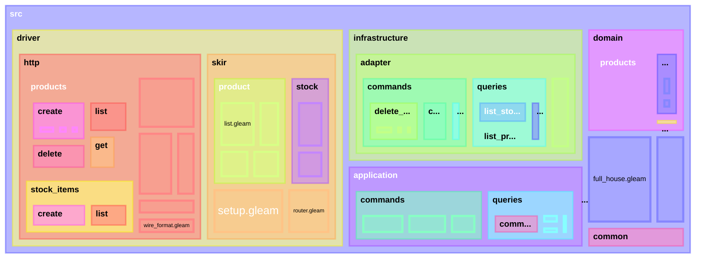
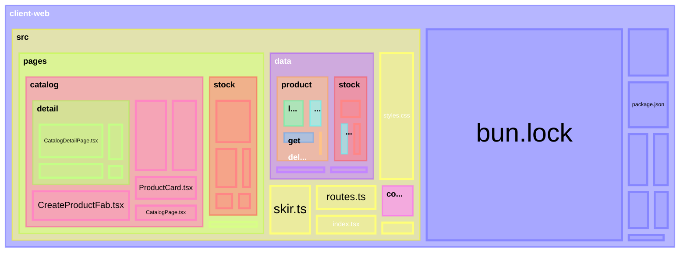
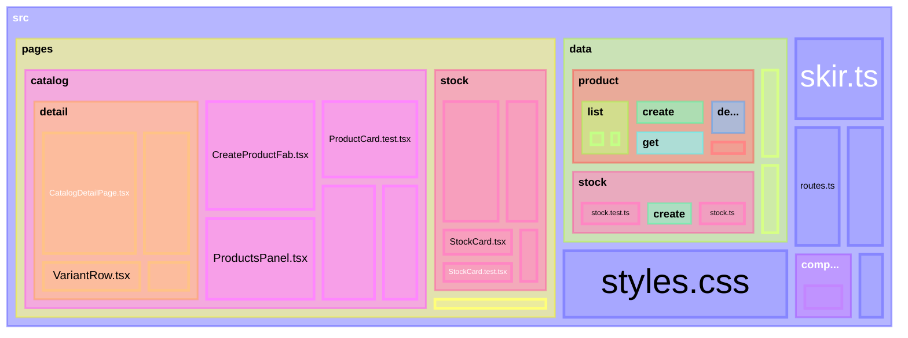

# Overview

```mermaid
---
config:
  treemap:
    showValues: false
---
treemap-beta
"full-house"
  ".devcontainer"
    "devcontainer-lock.json": 24
    "devcontainer.json": 43
    "post_create.sh": 29
  ".vscode"
    "settings.json": 42
    "tasks.json": 65
  "client-web"
    "src"
      "components"
        "AppBar.tsx": 35
      "data"
        "product"
          "create"
            "mutation.ts": 13
            "request.ts": 30
          "delete"
            "mutation.ts": 21
            "request.ts": 10
          "get"
            "query.ts": 23
            "request.ts": 20
          "list"
            "query.ts": 27
            "request.ts": 35
          "product.ts": 16
        "stock"
          "create"
            "mutation.ts": 16
            "request.ts": 25
          "stock.test.ts": 51
          "stock.ts": 41
        "api_helper.ts": 24
        "tanstack_helper.ts": 19
      "pages"
        "catalog"
          "detail"
            "CatalogDetailPage.tsx": 207
            "CreateStockItemButton.tsx": 108
            "ParentLink.tsx": 28
            "VariantRow.tsx": 61
          "CatalogPage.tsx": 60
          "CreateProductFab.tsx": 156
          "ProductCard.test.tsx": 99
          "ProductCard.tsx": 83
          "ProductsPanel.tsx": 119
        "stock"
          "StockCard.test.tsx": 26
          "StockCard.tsx": 33
          "StockHero.tsx": 20
          "StockPage.tsx": 65
          "StockPanel.tsx": 105
        "paginated_query_helpers.ts": 20
      "App.tsx": 17
      "index.tsx": 41
      "routes.ts": 50
      "skir.ts": 64
      "styles.css": 133
    ".env.development": 1
    "biome.json": 31
    "bun.lock": 925
    "eslint.config.ts": 51
    "index.html": 18
    "package.json": 50
    "tsconfig.json": 23
    "vite.config.ts": 25
    "vitest.config.ts": 11
  "deploy"
    "healthcheck.sh": 17
    "start.sh": 4
  "docs"
    "dev"
      "overview.md": 2
  "scripts"
    "build_treemaps.sh": 22
    "setup_dev_db.py": 146
    "treemap.py": 81
  "server"
    "data"
    "db"
      "migrations"
        "0001_create_products.sql": 9
        "0002_create_stock_items.sql": 12
        "0003_enforce_non_empty_product_name.sql": 20
        "0004_add_parent_id_index.sql": 5
      "seeds"
        "dev"
          "dev_seed.sql": 28
    "linting"
      "src"
        "rules"
          "depends_only_on.gleam": 110
        "source_map.gleam": 39
      "gleam.toml": 30
      "manifest.toml": 24
    "src"
      "application"
        "commands"
          "create_product.gleam": 76
          "create_stock_item.gleam": 48
          "delete_product.gleam": 71
        "queries"
          "common"
            "page_limit.gleam": 31
            "page_offset.gleam": 22
            "paging.gleam": 10
            "product_query_model.gleam": 13
            "stock_item_query_model.gleam": 9
          "get_product.gleam": 18
          "list_products.gleam": 16
          "list_stock_items.gleam": 16
        "shared"
          "infrastructure_error.gleam": 3
      "common"
        "product_id.gleam": 20
        "uuid.gleam": 20
      "domain"
        "basics"
          "conditional.gleam": 17
          "non_empty_set.gleam": 28
        "products"
          "deletable_product_id.gleam": 34
          "existing_product_id.gleam": 23
          "product.gleam": 12
          "product_name.gleam": 56
        "stock_items"
          "stock_item.gleam": 7
      "driver"
        "http"
          "products"
            "create"
              "handler.gleam": 46
              "request_mapper.gleam": 27
              "response_mapper.gleam": 29
            "delete"
              "handler.gleam": 68
            "get"
              "handler.gleam": 46
            "list"
              "handler.gleam": 31
              "response_mapper.gleam": 29
            "skir.gleam": 18
          "stock_items"
            "create"
              "handler.gleam": 42
              "request_mapper.gleam": 31
              "response_mapper.gleam": 25
            "list"
              "handler.gleam": 31
              "response_mapper.gleam": 38
          "handler_helpers.gleam": 39
          "pagination_request_mapper.gleam": 86
          "router.gleam": 65
          "skir.gleam": 30
          "wire_format.gleam": 30
        "skir"
          "product"
            "create.gleam": 53
            "delete.gleam": 43
            "get.gleam": 45
            "list.gleam": 84
          "stock"
            "create.gleam": 48
            "list.gleam": 79
          "router.gleam": 59
          "setup.gleam": 96
      "infrastructure"
        "adapter"
          "commands"
            "create_product"
              "create_adapter.gleam": 42
              "product_existence_adapter.gleam": 42
            "create_stock_item"
              "create_adapter.gleam": 37
            "delete_product"
              "delete_adapter.gleam": 35
              "deletion_properties_adapter.gleam": 82
              "load_product_adapter.gleam": 39
          "queries"
            "get_product"
              "get_product_adapter.gleam": 40
            "list_products"
              "list_products_adapter.gleam": 69
            "list_stock_items"
              "list_stock_items_adapter.gleam": 92
          "decoder.gleam": 57
      "composition.gleam": 49
      "full_house.gleam": 101
    "test"
      "integration"
        "driver"
          "http"
            "products"
              "delete_test.gleam": 132
            "testsetup.gleam": 36
          "product_route_test.gleam": 344
        "infrastructure"
          "commands"
            "create_product"
              "create_adapter_test.gleam": 49
            "delete_product"
              "delete_adapter_test.gleam": 45
              "deletion_properties_adapter_test.gleam": 41
              "load_product_adapter_test.gleam": 23
          "stock_repository_test.gleam": 67
          "testdatabase.gleam": 32
        "create.gleam": 45
      "unit"
        "domain"
          "product_name_property_test.gleam": 62
          "product_name_test.gleam": 54
      "full_house_test.gleam": 5
      "lint.gleam": 83
    ".editorconfig": 3
    "gleam.toml": 38
    "manifest.toml": 59
  "skir-src"
    "product.skir": 49
    "stock.skir": 34
  ".editorconfig": 5
  "AGENTS.md": 33
  "CONTRIBUTING.md": 85
  "Dockerfile": 57
  "LICENSE": 21
  "README.md": 83
  "lefthook.yml": 32
  "skir-snapshot.json": 38
  "skir.yml": 7
```
## Server

```mermaid
---
config:
  treemap:
    showValues: false
---
treemap-beta
"server"
  "data"
  "db"
    "migrations"
      "0001_create_products.sql": 9
      "0002_create_stock_items.sql": 12
      "0003_enforce_non_empty_product_name.sql": 20
      "0004_add_parent_id_index.sql": 5
    "seeds"
      "dev"
        "dev_seed.sql": 28
  "linting"
    "src"
      "rules"
        "depends_only_on.gleam": 110
      "source_map.gleam": 39
    "gleam.toml": 30
    "manifest.toml": 24
  "src"
    "application"
      "commands"
        "create_product.gleam": 76
        "create_stock_item.gleam": 48
        "delete_product.gleam": 71
      "queries"
        "common"
          "page_limit.gleam": 31
          "page_offset.gleam": 22
          "paging.gleam": 10
          "product_query_model.gleam": 13
          "stock_item_query_model.gleam": 9
        "get_product.gleam": 18
        "list_products.gleam": 16
        "list_stock_items.gleam": 16
      "shared"
        "infrastructure_error.gleam": 3
    "common"
      "product_id.gleam": 20
      "uuid.gleam": 20
    "domain"
      "basics"
        "conditional.gleam": 17
        "non_empty_set.gleam": 28
      "products"
        "deletable_product_id.gleam": 34
        "existing_product_id.gleam": 23
        "product.gleam": 12
        "product_name.gleam": 56
      "stock_items"
        "stock_item.gleam": 7
    "driver"
      "http"
        "products"
          "create"
            "handler.gleam": 46
            "request_mapper.gleam": 27
            "response_mapper.gleam": 29
          "delete"
            "handler.gleam": 68
          "get"
            "handler.gleam": 46
          "list"
            "handler.gleam": 31
            "response_mapper.gleam": 29
          "skir.gleam": 18
        "stock_items"
          "create"
            "handler.gleam": 42
            "request_mapper.gleam": 31
            "response_mapper.gleam": 25
          "list"
            "handler.gleam": 31
            "response_mapper.gleam": 38
        "handler_helpers.gleam": 39
        "pagination_request_mapper.gleam": 86
        "router.gleam": 65
        "skir.gleam": 30
        "wire_format.gleam": 30
      "skir"
        "product"
          "create.gleam": 53
          "delete.gleam": 43
          "get.gleam": 45
          "list.gleam": 84
        "stock"
          "create.gleam": 48
          "list.gleam": 79
        "router.gleam": 59
        "setup.gleam": 96
    "infrastructure"
      "adapter"
        "commands"
          "create_product"
            "create_adapter.gleam": 42
            "product_existence_adapter.gleam": 42
          "create_stock_item"
            "create_adapter.gleam": 37
          "delete_product"
            "delete_adapter.gleam": 35
            "deletion_properties_adapter.gleam": 82
            "load_product_adapter.gleam": 39
        "queries"
          "get_product"
            "get_product_adapter.gleam": 40
          "list_products"
            "list_products_adapter.gleam": 69
          "list_stock_items"
            "list_stock_items_adapter.gleam": 92
        "decoder.gleam": 57
    "composition.gleam": 49
    "full_house.gleam": 101
  "test"
    "integration"
      "driver"
        "http"
          "products"
            "delete_test.gleam": 132
          "testsetup.gleam": 36
        "product_route_test.gleam": 344
      "infrastructure"
        "commands"
          "create_product"
            "create_adapter_test.gleam": 49
          "delete_product"
            "delete_adapter_test.gleam": 45
            "deletion_properties_adapter_test.gleam": 41
            "load_product_adapter_test.gleam": 23
        "stock_repository_test.gleam": 67
        "testdatabase.gleam": 32
      "create.gleam": 45
    "unit"
      "domain"
        "product_name_property_test.gleam": 62
        "product_name_test.gleam": 54
    "full_house_test.gleam": 5
    "lint.gleam": 83
  ".editorconfig": 3
  "gleam.toml": 38
  "manifest.toml": 59
```

```mermaid
---
config:
  treemap:
    showValues: false
---
treemap-beta
"src"
  "application"
    "commands"
      "create_product.gleam": 76
      "create_stock_item.gleam": 48
      "delete_product.gleam": 71
    "queries"
      "common"
        "page_limit.gleam": 31
        "page_offset.gleam": 22
        "paging.gleam": 10
        "product_query_model.gleam": 13
        "stock_item_query_model.gleam": 9
      "get_product.gleam": 18
      "list_products.gleam": 16
      "list_stock_items.gleam": 16
    "shared"
      "infrastructure_error.gleam": 3
  "common"
    "product_id.gleam": 20
    "uuid.gleam": 20
  "domain"
    "basics"
      "conditional.gleam": 17
      "non_empty_set.gleam": 28
    "products"
      "deletable_product_id.gleam": 34
      "existing_product_id.gleam": 23
      "product.gleam": 12
      "product_name.gleam": 56
    "stock_items"
      "stock_item.gleam": 7
  "driver"
    "http"
      "products"
        "create"
          "handler.gleam": 46
          "request_mapper.gleam": 27
          "response_mapper.gleam": 29
        "delete"
          "handler.gleam": 68
        "get"
          "handler.gleam": 46
        "list"
          "handler.gleam": 31
          "response_mapper.gleam": 29
        "skir.gleam": 18
      "stock_items"
        "create"
          "handler.gleam": 42
          "request_mapper.gleam": 31
          "response_mapper.gleam": 25
        "list"
          "handler.gleam": 31
          "response_mapper.gleam": 38
      "handler_helpers.gleam": 39
      "pagination_request_mapper.gleam": 86
      "router.gleam": 65
      "skir.gleam": 30
      "wire_format.gleam": 30
    "skir"
      "product"
        "create.gleam": 53
        "delete.gleam": 43
        "get.gleam": 45
        "list.gleam": 84
      "stock"
        "create.gleam": 48
        "list.gleam": 79
      "router.gleam": 59
      "setup.gleam": 96
  "infrastructure"
    "adapter"
      "commands"
        "create_product"
          "create_adapter.gleam": 42
          "product_existence_adapter.gleam": 42
        "create_stock_item"
          "create_adapter.gleam": 37
        "delete_product"
          "delete_adapter.gleam": 35
          "deletion_properties_adapter.gleam": 82
          "load_product_adapter.gleam": 39
      "queries"
        "get_product"
          "get_product_adapter.gleam": 40
        "list_products"
          "list_products_adapter.gleam": 69
        "list_stock_items"
          "list_stock_items_adapter.gleam": 92
      "decoder.gleam": 57
  "composition.gleam": 49
  "full_house.gleam": 101
```
## Webclient

```mermaid
---
config:
  treemap:
    showValues: false
---
treemap-beta
"client-web"
  "src"
    "components"
      "AppBar.tsx": 35
    "data"
      "product"
        "create"
          "mutation.ts": 13
          "request.ts": 30
        "delete"
          "mutation.ts": 21
          "request.ts": 10
        "get"
          "query.ts": 23
          "request.ts": 20
        "list"
          "query.ts": 27
          "request.ts": 35
        "product.ts": 16
      "stock"
        "create"
          "mutation.ts": 16
          "request.ts": 25
        "stock.test.ts": 51
        "stock.ts": 41
      "api_helper.ts": 24
      "tanstack_helper.ts": 19
    "pages"
      "catalog"
        "detail"
          "CatalogDetailPage.tsx": 207
          "CreateStockItemButton.tsx": 108
          "ParentLink.tsx": 28
          "VariantRow.tsx": 61
        "CatalogPage.tsx": 60
        "CreateProductFab.tsx": 156
        "ProductCard.test.tsx": 99
        "ProductCard.tsx": 83
        "ProductsPanel.tsx": 119
      "stock"
        "StockCard.test.tsx": 26
        "StockCard.tsx": 33
        "StockHero.tsx": 20
        "StockPage.tsx": 65
        "StockPanel.tsx": 105
      "paginated_query_helpers.ts": 20
    "App.tsx": 17
    "index.tsx": 41
    "routes.ts": 50
    "skir.ts": 64
    "styles.css": 133
  ".env.development": 1
  "biome.json": 31
  "bun.lock": 925
  "eslint.config.ts": 51
  "index.html": 18
  "package.json": 50
  "tsconfig.json": 23
  "vite.config.ts": 25
  "vitest.config.ts": 11
```

```mermaid
---
config:
  treemap:
    showValues: false
---
treemap-beta
"src"
  "components"
    "AppBar.tsx": 35
  "data"
    "product"
      "create"
        "mutation.ts": 13
        "request.ts": 30
      "delete"
        "mutation.ts": 21
        "request.ts": 10
      "get"
        "query.ts": 23
        "request.ts": 20
      "list"
        "query.ts": 27
        "request.ts": 35
      "product.ts": 16
    "stock"
      "create"
        "mutation.ts": 16
        "request.ts": 25
      "stock.test.ts": 51
      "stock.ts": 41
    "api_helper.ts": 24
    "tanstack_helper.ts": 19
  "pages"
    "catalog"
      "detail"
        "CatalogDetailPage.tsx": 207
        "CreateStockItemButton.tsx": 108
        "ParentLink.tsx": 28
        "VariantRow.tsx": 61
      "CatalogPage.tsx": 60
      "CreateProductFab.tsx": 156
      "ProductCard.test.tsx": 99
      "ProductCard.tsx": 83
      "ProductsPanel.tsx": 119
    "stock"
      "StockCard.test.tsx": 26
      "StockCard.tsx": 33
      "StockHero.tsx": 20
      "StockPage.tsx": 65
      "StockPanel.tsx": 105
    "paginated_query_helpers.ts": 20
  "App.tsx": 17
  "index.tsx": 41
  "routes.ts": 50
  "skir.ts": 64
  "styles.css": 133
```
